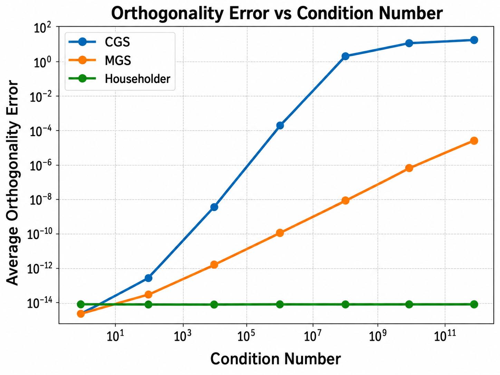
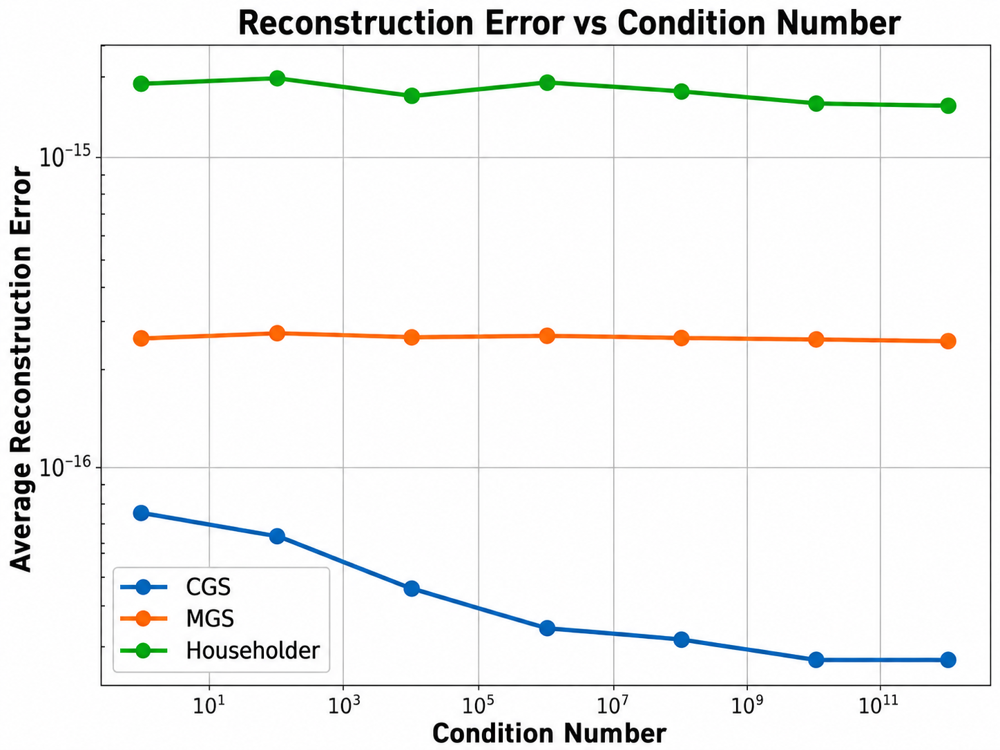
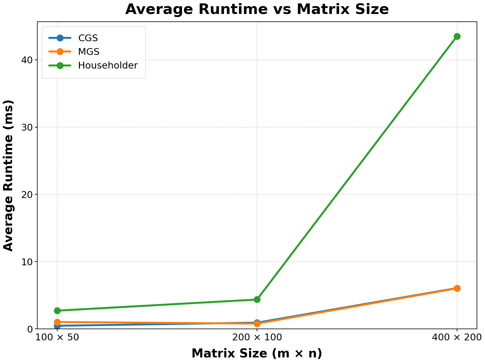

# QR Decomposition Comparison

This project implements and compares three QR decomposition methods in Java:

- Classical Gram-Schmidt (CGS)
- Modified Gram-Schmidt (MGS)
- Householder Reflection

The main focus is on numerical stability and computational efficiency.

## Numerical Stability Experiment

The numerical stability experiment compares the three methods using:

- Orthogonality error
- Reconstruction error

Matrices with different condition numbers are tested to study how numerical stability changes as the matrices become more ill-conditioned.

Experimental settings:

- Matrix size: 100 × 50
- Test rounds: 20
- Condition numbers: 1, 1e2, 1e4, 1e6, 1e8, 1e10, 1e12

Results:

- Orthogonality Error:



- Reconstruction Error:



## Runtime Experiment

A simple runtime comparison is also included as a follow-up extension.

Matrix sizes:

- 100 × 50
- 200 × 100
- 400 × 200

Each method is run 100 times and the average runtime is recorded.

Runtime Results:



## Key Findings

- CGS becomes increasingly unstable as the condition number grows, with a large increase in orthogonality error.
- MGS is more numerically stable than CGS, but its orthogonality error also increases for highly ill-conditioned matrices.
- Householder maintains very low orthogonality error across all tested condition numbers.
- All three methods maintain small reconstruction errors in the experiments.
- In the runtime experiment, CGS and MGS have similar performance, while the Householder implementation requires more runtime, especially for larger matrices.

The runtime results are based on the Java implementations in this project and are intended as an empirical comparison rather than a general performance ranking of the algorithms.

## Original Research Poster

This project was originally conducted as a summer research project focusing on the numerical stability of QR decomposition methods.

The runtime experiment presented above was added later as a follow-up extension.

[View the original research poster (PDF)](poster/QR-Decomposition-Poster.pdf)

[Download the original PowerPoint file](poster/QR-Decomposition-Poster.pptx)

## Project Structure

```text
src/qrdecomposition/
├── GramSchmidt.java
├── ModifiedGramSchmidt.java
├── Householder.java
├── NumericalStabilityExperiment.java
├── RuntimeExperiment.java
├── ConditionedMatrixGenerator.java
├── MatrixGenerator.java
├── MatrixUtil.java
├── VectorUtil.java
├── GetColumn.java
├── QRResult.java
└── ErrorResult.java
